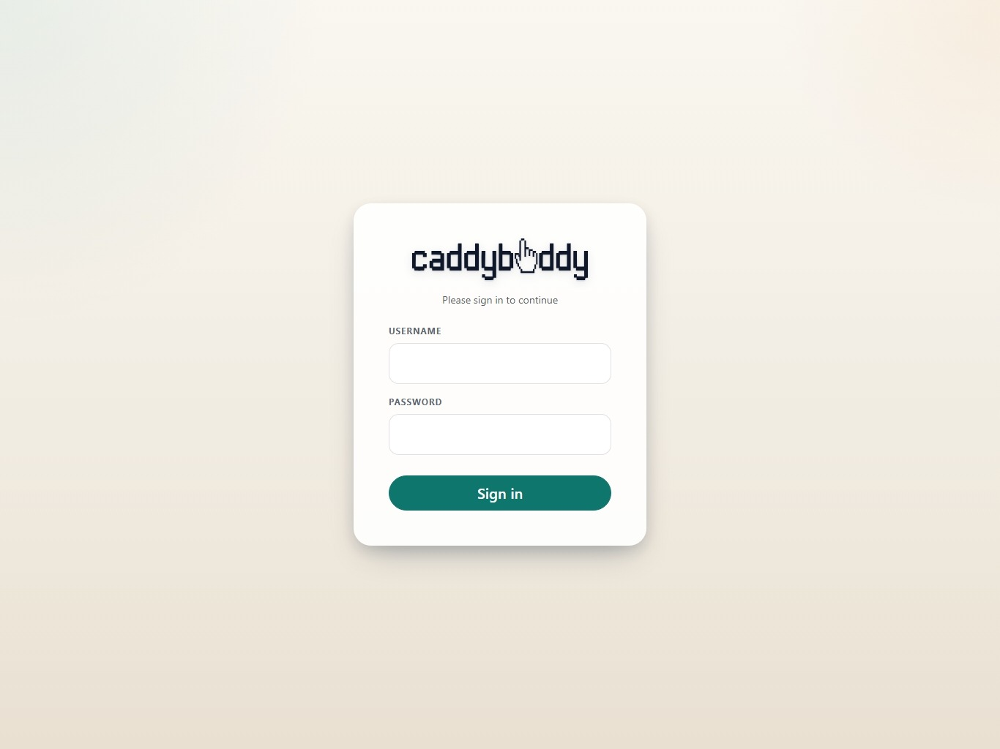
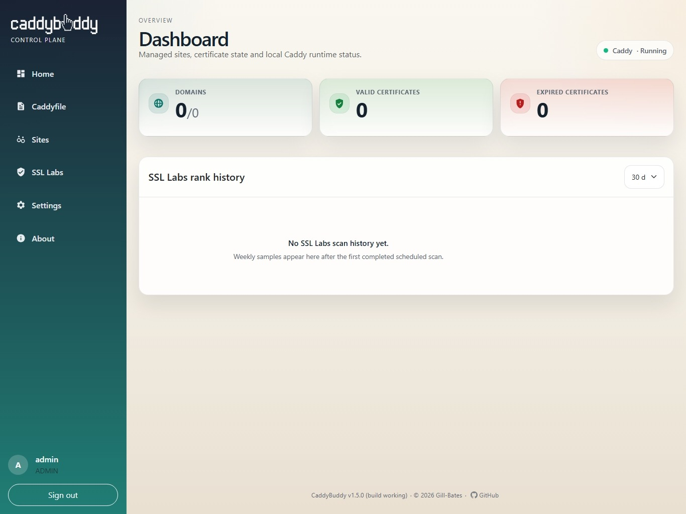
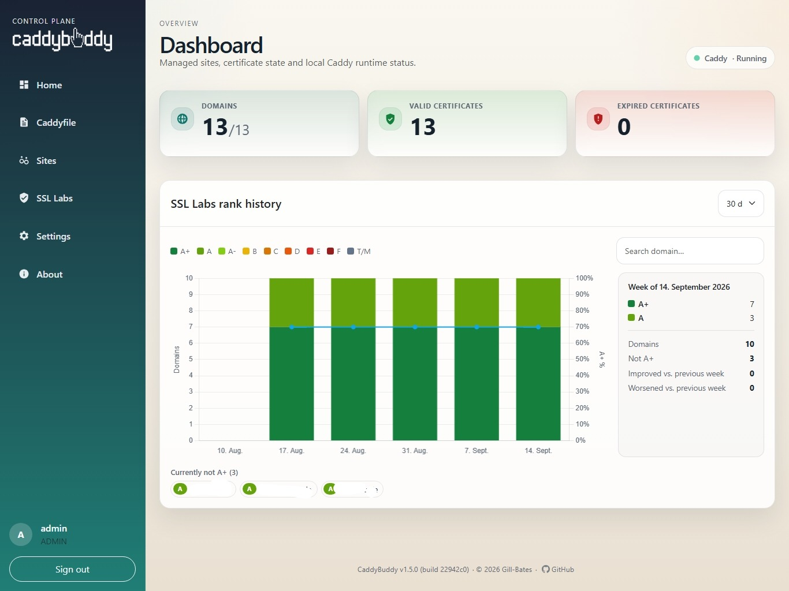

<p align="center">
  
</p>

<p align="center">
  A focused web control plane for one Caddy installation.
</p>

<p align="center">
  <a href="https://github.com/Gill-Bates/caddybuddy/releases"></a>
  <a href="https://hub.docker.com/r/giiibates/caddybuddy"></a>
  <a href="https://gill-bates.github.io/caddybuddy/"></a>
  
</p>

CaddyBuddy provides guided onboarding, site and Caddyfile management, certificate visibility and renewal, weekly or monthly SSL Labs assessments, and health monitoring from a server-rendered FastAPI application.

## Screenshots

<p align="center">
  
</p>
<p align="center">
  
</p>
<p align="center">
  
</p>

## Quick Start

```bash
export CB_SECRET_KEY="$(head -c 32 /dev/urandom | base64)"
CADDYBUDDY_VERSION=latest docker compose -f docker/docker-compose.yml.example up -d
```

Open `http://127.0.0.1:8000`, create the initial administrator account, and complete the onboarding wizard.

## Documentation

Full installation, configuration, operation, and development documentation:

**https://gill-bates.github.io/caddybuddy/**

Additional links: [Docker Hub](https://hub.docker.com/r/giiibates/caddybuddy) · [Releases](https://github.com/Gill-Bates/caddybuddy/releases) · [Changelog](CHANGELOG.md)

## License

CaddyBuddy is distributed under the [MIT License](LICENSE).

<p align="center">
  <a href="https://www.buymeacoffee.com/tnsteinerx">
    
  </a>
</p>